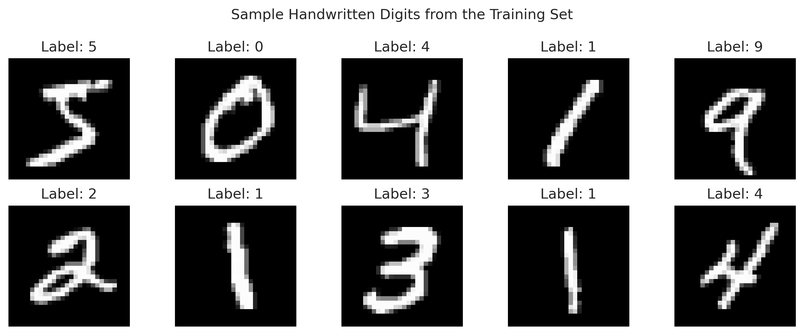
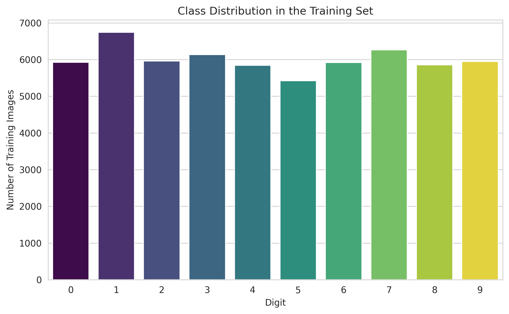
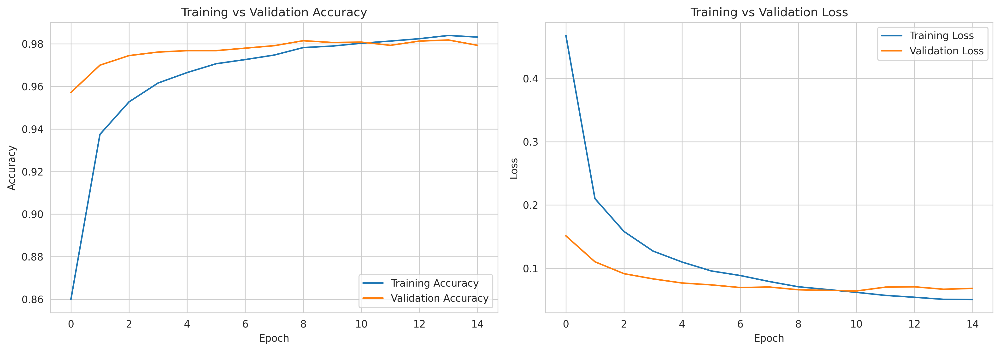
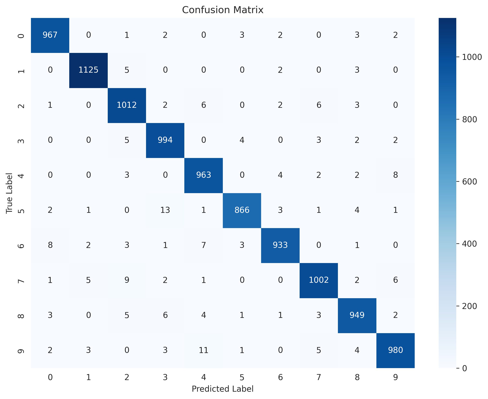
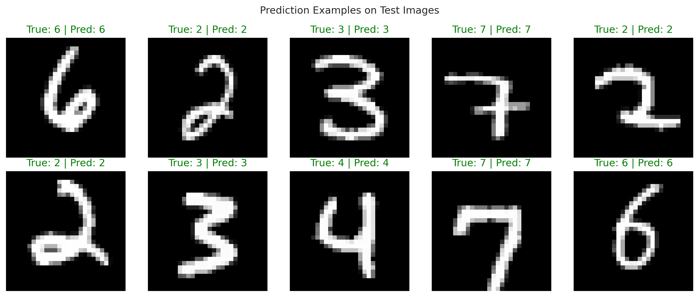
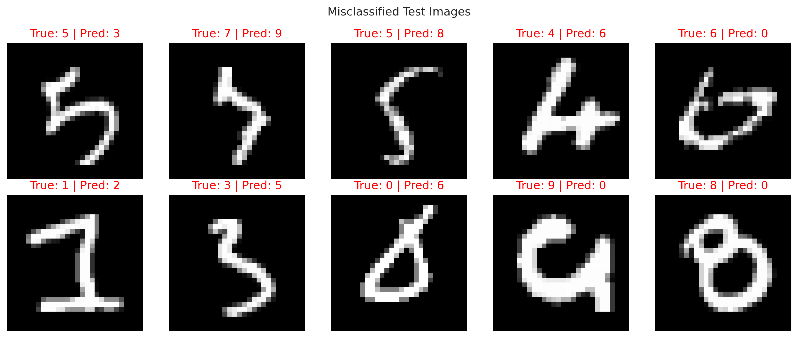

# Level 3 - Task 3: Neural Network Classification with TensorFlow/Keras

**Codveda Technologies Machine Learning Internship**

A feed-forward neural network built with TensorFlow/Keras to classify handwritten digits from the MNIST dataset.

## Project Overview

This project implements an end-to-end deep learning pipeline: loading and exploring the MNIST dataset, preprocessing images, designing a fully-connected neural network, training it with backpropagation, and evaluating its performance through accuracy metrics, a confusion matrix, and visual prediction examples.

**Dataset:** [MNIST Handwritten Digits](http://yann.lecun.com/exdb/mnist/) — 70,000 grayscale images (28x28 pixels) of digits 0-9, loaded directly via `tensorflow.keras.datasets.mnist`.

## Model Architecture

| Layer | Type | Units | Activation | Notes |
|---|---|---|---|---|
| Input | Dense input | 784 | — | Flattened 28x28 image |
| Hidden 1 | Dense | 128 | ReLU | Followed by Dropout (0.2) |
| Hidden 2 | Dense | 64 | ReLU | Followed by Dropout (0.2) |
| Output | Dense | 10 | Softmax | One probability per digit |

- **Optimizer:** Adam
- **Loss function:** Categorical Crossentropy
- **Epochs:** 15, **Batch size:** 128, **Validation split:** 10%
- **Total parameters:** 109,386

## Results

| Metric | Score |
|---|---|
| Test Accuracy | **97.91%** |
| Test Loss | 0.0751 |
| Final Training Accuracy | 98.32% |
| Final Validation Accuracy | 97.93% |

The gap between training and validation accuracy stayed small (~0.4%), indicating the model generalized well rather than overfitting to the training data. Out of 10,000 test images, only 209 were misclassified.

**Classification Report (test set):**

| Digit | Precision | Recall | F1-score |
|---|---|---|---|
| 0 | 0.98 | 0.99 | 0.98 |
| 1 | 0.99 | 0.99 | 0.99 |
| 2 | 0.97 | 0.98 | 0.98 |
| 3 | 0.97 | 0.98 | 0.98 |
| 4 | 0.97 | 0.98 | 0.98 |
| 5 | 0.99 | 0.97 | 0.98 |
| 6 | 0.99 | 0.97 | 0.98 |
| 7 | 0.98 | 0.97 | 0.98 |
| 8 | 0.98 | 0.97 | 0.97 |
| 9 | 0.98 | 0.97 | 0.98 |

## Visualizations

| | |
|---|---|
|  |  |
|  |  |
|  |  |

## Key Takeaways

- Most classification errors occurred between visually similar digit pairs, such as **4/9** and **3/5**.
- A plain feed-forward network flattens each image and loses spatial pixel relationships; a **Convolutional Neural Network (CNN)** would likely improve on this baseline.
- Real-world applications of this approach include postal code recognition, bank check processing, and digitizing handwritten forms.

## Project Structure
├── Level3_Task3_NeuralNetwork_MNIST.ipynb   # Full notebook (data loading -> training -> evaluation)
├── outputs/
│   ├── charts/                              # Saved visualizations (PNG)
│   └── model/
│       └── mnist_neural_network.keras       # Trained model
└── README.md

## Tools & Libraries

Python · TensorFlow/Keras · NumPy · Matplotlib · Seaborn · scikit-learn

## How to Run

1. Open `Level3_Task3_NeuralNetwork_MNIST.ipynb` in Google Colab.
2. Run all cells top to bottom (mounts Google Drive to save outputs; MNIST loads automatically via Keras).
3. Trained model and charts are saved automatically to the `outputs/` folder in Google Drive.

---
## Author

**Lady Jean Y. Geverola**

BS Data Science  
University of the Philippines Mindanao

